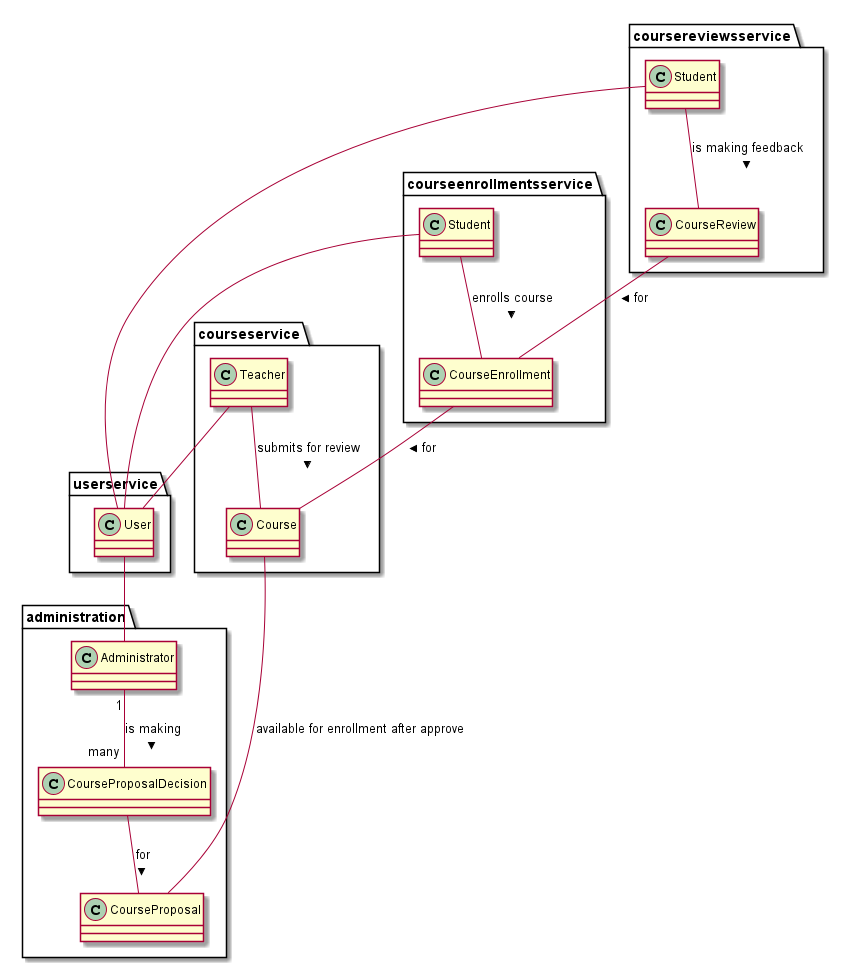

# Educational platform

Modular Monolith Java application with DDD. In the plans, this application should be easily rewritten as microservices.
- [1. The goals of this application](#1-the-goals-of-this-application)
- [2. Plan](#2-plan)
- [3. Architecture](#3-architecture)
- [4. Contribution](#4-contribution)
- [5. Useful links](#5-useful-links)

## 1. The goals of this application
- example of modular monolith with DDD;
- example of communications between bounded contexts;
- example of simple CQRS implementation;
- example of documentation of architecture decisions;

## 2. Plan
| Feature | Status |
| ------- | ------ |
| Reach documentation | COMPLETED |
| DDD building blocks | COMPLETED |
| Modular monolith with base functionality | COMPLETED |
| Authentication/Security rules in application | COMPLETED |
| API | COMPLETED |
| Architecture tests | COMPLETED |
| Integration events as public sub-module for each module | COMPLETED |
| Axon Framework integration | IN PROGRESS |
| Extend functionality in modules |  |
| UI application |  |
| Microservices |  |

## 3. Architecture
### 3.1. Modules
**Administration**
`Administrator` can approve or decline `CourseProposal`. After approving or declining the proposal, corresponding integration event is published to other modules.

**Courses**
A `Teacher` can create new `Course`. This `Course` can be edited. A `Student` can view the list of `Course` and search by different parameters. The `Course` contains the list of `Lecture`. After getting the approval, `Course` can be published. Depends on other modules, number of students and course rating can be recalculated.

**Course Enrollments**
A `Student` can enroll `Course`. A `Lecture` can be marked as completed. `Student` can view the list of `Course Enrollment`. `Course Enrollment` can be archived, completed. On new enrollment action, the number of students is recalculated and new number is published as integration event.

**Course Reviews**
A `Student` can create/edit feedback to enrolled `Course`. The list of `Course Review` are used for calculating the rating of `Course` and `Teacher`. `Course Review` contains comment and rating.

**Users**
A `User` can be created after registration. `User` has the list of `Permission`. `User` can edit info in profile. `User` has role `Student` after registration. `User` can become a `Teacher`. After registration, the integration event about new user is published to other modules.

### 3.2. Communications between bounded contexts
Communication between bounded contexts is asynchronous. Bounded contexts don't share data, it's forbidden to create a transaction which spans more than one bounded context.

This solution reduces coupling of bounded contexts through data replication across contexts which results to higher bounded contexts independence.

### 3.3. Validation
Always valid approach is used. So domain model will be changed from one valid state to another valid state. Technically, validation rules are defined on `Command` models.

### 3.4. CQRS
CQRS solution is used. It will give us flexibility in optimizing model for read and write operations. The simple version of CQRS is implemented in this application.

### 3.5. The identifiers for communication between modules
Natural keys or uuids should be used. Primary keys are forbidden for communications between modules or with external systems.

### 3.6. API First
API First is one of engineering and architecture principles. In a nutshell API First requires two aspects:
- define APIs first, before coding its implementation, using a standard specification language;
- get early review feedback from peers and client developers;

By defining APIs outside the code, we want to facilitate early review feedback and also a development discipline that focus service interface design on…​
- profound understanding of the domain and required functionality
- generalized business entities / resources, i.e. avoidance of use case specific APIs
- clear separation of WHAT vs. HOW concerns, i.e. abstraction from implementation aspects — APIs should be stable even if we replace complete service implementation including its underlying technology stack

### 3.7. Rich Domain Model
Rich domain model solution is used. This API from domain model will be easy to use. Domain model will encapsulate internal structure.

### 3.8. Architecture Decisions
All decisions inside this project [docs/architecture-decisions](docs/architecture-decisions).

### 3.9. Results from command handlers
The idea from CQRS - do not return anything from command processing. But in some cases, we need to get generated identifiers of new created resources. So as trade-off, command handlers can return generated identifiers after processing if it's needed.

### 3.10. Architecture tests
We need to have the mechanism for supporting common architecture principles in all application. Architecture tests with Archunit are used for these goals.

### 3.11. Bounded context map

### 3.12. Integration event inside application

### 3.13. Technology stack
- Spring
- Java
- Lombok

## 4. Contribution
The application is in development status. Please feel free to submit pull request or create the issue.

## 5. Useful links
The knowledge base about Java, DDD and other topics - [https://github.com/anton-liauchuk/java-interview](https://github.com/anton-liauchuk/java-interview)

